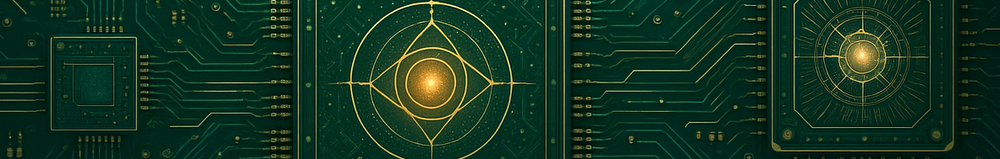

<!---->

# Hi there! I’m Drew 🌟
An AI/ML enthusiast with a knack for solving tough problems.

---
## About Me
- 🎓 MSc in Artificial Intelligence with top-tier academic creds.
- 🤖 Aspiring AI/ML engineer specializing in reinforcement learning.
- 💻 Love coding solutions to complex problems.
- 🌱 Currently exploring cutting-edge AI research.
- 😄 Pronouns: He/Him
<!--- 🔭 I’m currently working on
- ⚡ Fun fact:-->

---

## Skills
### Languages
    

### Libraries/Frameworks
                  

### Tools
    

### Technical Skills
                   

---

## Projects

- 🏎️ **[MSc Thesis: Reinforcement Learning in TORCS](https://github.com/drewberry612/torcs-research)**  
  Built AI driving models for the TORCS racing sim using genetic algorithms and PPO reinforcement learning.

- 👊 **[Street Fighter Engine](https://github.com/drewberry612/street-fighter)**  
  Developed a Java-based game engine from scratch, later used by another MSc student for RL research.

- 🐦 **[Angry Birds Clone](https://github.com/drewberry612/angry-birds)**  
  Created a physics-based clone of Angry Birds with custom mechanics and gameplay.

- 🧠 **[Autograd with NumPy](https://github.com/drewberry612/autograd)**  
  Implemented autograd functionality for neural networks using only NumPy.

- 📊 **[Kaggle Competitions](https://github.com/drewberry612/kaggle-comps)**  
  Tackled real-world ML challenges on Kaggle ([profile](https://kaggle.com/drewberry6)), applying advanced techniques to diverse datasets.
<!--
---

## Fun Facts

- ⚡ I once [fun fact about coding/AI/games]!
- 🎮 My favorite game is [game name].
- ☕ I’ve consumed [number] cups of coffee while coding this year.
-->
---

## 📫 Connect With Me
🤝 **[LinkedIn](https://linkedin.com/in/drew-berry)** | 💻 **[GitHub](https://github.com/drewberry612)** | 📧 **[Email](mailto:drewberry137@outlook.com)**

🌍 Based in the UK

Open to Work | AI/ML engineering roles | Open to remote/hybrid/onsite opportunities

---

## GitHub Stats

<!---->

---
